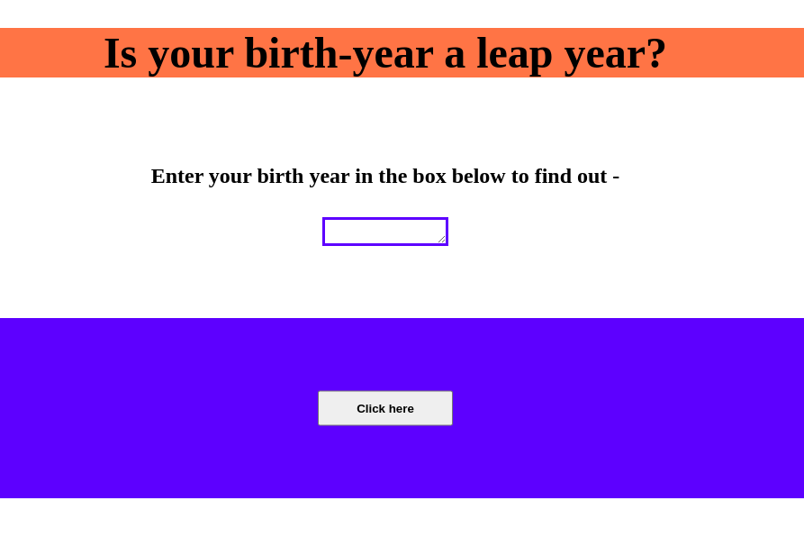

# leap-year
An app in vanillaJS to check whether the entered year is leap year or not.

How to use - 
Enter your birth-year in the box and you'll know if your year of birth is a leap year or not.

Preview - 

